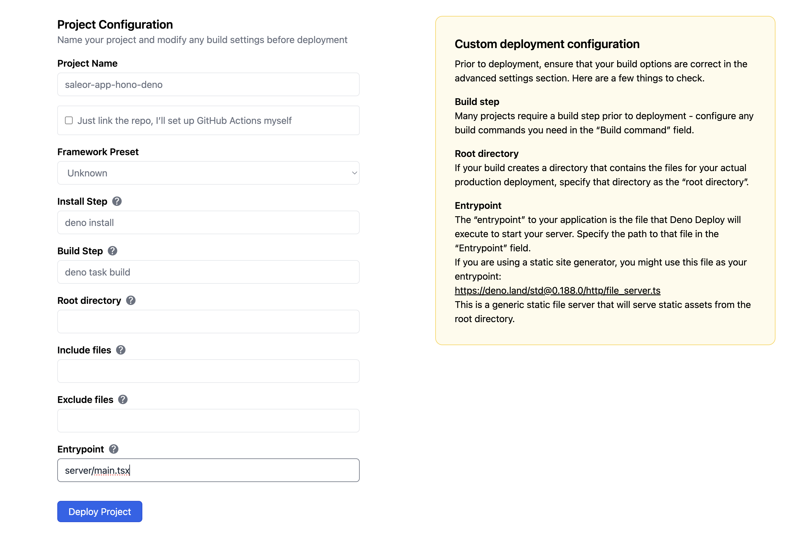

# Saleor App Order Hash Generator

A lightweight Saleor app that generates unique hash values for orders and provides an API to query order status by hash.

## Features

This app extends the basic Saleor app template with the following features:

1. **Order Hash Generation**: Automatically generates a unique cryptographic hash for each new order
2. **Metadata Storage**: Stores the hash in the order's metadata in Saleor
3. **Database Persistence**: Uses Turso database to maintain a mapping between order IDs and hashes
4. **Order Status API**: Provides an endpoint to query order status using the generated hash
5. **Collision Prevention**: Implements multiple layers of protection against hash collisions

## How It Works

1. When a new order is created in Saleor, the app receives a webhook notification
2. The app generates a unique cryptographic hash for the order
3. The hash is checked against existing hashes in the database to prevent collisions
4. The hash is stored in the order's metadata in Saleor
5. The mapping between order ID and hash is stored in a Turso database
6. Users can query order status by making a GET request to `/api/order-status/{hash}`

## Collision Prevention

To ensure hash uniqueness and prevent collisions, the app implements several strategies:

1. **Cryptographically Secure Generation**: Uses the Web Crypto API to generate 256-bit random values
2. **Timestamp Enhancement**: Adds a timestamp component to the hash for additional uniqueness
3. **Database-Level Constraints**: Enforces UNIQUE constraints on the order_hash column in the database
4. **Application-Level Checking**: Verifies hash uniqueness against existing entries before insertion
5. **Retry Mechanism**: Attempts to generate a unique hash up to 5 times if a collision is detected

## Additional Configuration

### Environment Variables

In addition to the standard environment variables, you need to configure:

- `TURSO_DATABASE_URL`: The URL of your Turso database
- `TURSO_AUTH_TOKEN`: The authentication token for your Turso database

### Turso Database Setup

1. Create a Turso database at [Turso](https://turso.tech/)
2. Get your database URL and authentication token
3. Add these values to your `.env` file

## API Endpoints

### Query Order Status by Hash

```
GET /api/order-status/{hash}
```

Returns information about the order associated with the provided hash.

Example response:
```json
{
  "hash": "abcdef123456...",
  "orderId": "T3JkZXI6MQ==",
  "status": "found",
  "message": "Order found successfully"
}
```

## Usage

After installing the app in your Saleor instance:

1. New orders will automatically receive a unique hash in their metadata
2. Use the `/api/order-status/{hash}` endpoint to query order information by hash

## Project Structure

```
├── client/           # Frontend SPA for Saleor Dashboard
│   ├── index.html    # Entry point for Vite
│   └── src/          # React components
├── server/           # Backend API powered by Hono
│   ├── main.tsx      # Entry point for the server
│   ├── deno-kv-apl.ts # Deno KV-based APL implementation
│   └── api/          # API routes and webhooks
│       ├── index.ts   # Main API routes
│       ├── utils.ts   # Utility functions
│       └── webhooks/  # Webhook handlers
├── graphql/          # GraphQL schema and queries
├── generated/        # Generated GraphQL types
├── deno.json         # Deno configuration and tasks
└── vite.config.ts    # Vite configuration for building the SPA
```

## Prerequisites

- [Deno](https://deno.land/) (latest version recommended)
- A running Saleor instance
- A Turso database account

## Installation

1. Clone the repository:
   ```bash
   git clone https://github.com/witoszekdev/saleor-app-hono-deno-template.git
   cd saleor-app-order-hash-generator
   ```

2. Install dependencies:
   ```bash
   deno install
   ```

3. Configure environment variables in `.env`:
   ```env
   APL=deno
   TURSO_DATABASE_URL=your_turso_database_url
   TURSO_AUTH_TOKEN=your_turso_auth_token
   ```

4. Fetch the Saleor GraphQL schema:

> [!NOTE]
> This command has to be run either through `pnpm` or `npm` because it relies on specific package.json feature for getting Saleor schema version

   ```bash
   pnpm run fetch-schema
   # or
   npm run fetch-schema
   ```

5. Generate TypeScript types from the schema:
   ```bash
   deno task generate
   ```

## Development

You can run the project using:

```bash
deno task serve
```

it does 2 things:
1. Builds the frontend SPA using Vite (`deno task build`) to `server/dist` directory
2. Starts the Deno server in watch mode (`deno task server:start`)

After running the task app will be available at `http://localhost:3000` and will reload on each change in server code.

> ![WARN]
> Server will not reload after changes in `client` code, for that you need to run command
>
> ```bash
> deno task build
> ```

## Configuration

### Environment Variables

Set up environment variables as needed:

- `APL`: Set to `deno` to use Deno KV-based APL.
- `TURSO_DATABASE_URL`: Your Turso database URL
- `TURSO_AUTH_TOKEN`: Your Turso authentication token
- Other sensitive data like API keys should be managed securely using Deno's environment management.

### Customizing Routes

The SPA is served at `/app`, but you can modify this route in `server/main.tsx`. Update the `serveStatic` configuration as needed and `api/manifest` implementation.

## Deployment

You can deploy this app using any platform that supports Deno:

1. **Deno Deploy**:
   - Push your code to a GitHub repository.
   - Connect your repository to [Deno Deploy](https://deno.com/deploy).
   - Use following settings when setting up project:
      - **Install step**: `deno install`
      - **Build step**: `deno task build`
      - **Entry Point**: `server/main.tsx`
      - **Env variables**:
        - `APL`: `deno`
        - `TURSO_DATABASE_URL`: your_turso_database_url
        - `TURSO_AUTH_TOKEN`: your_turso_auth_token


   
2. **Self-hosted Deployment**:
   - Run on your server:
     ```bash
     deno run --allow-net --allow-read --allow-env --unstable-kv server/main.tsx
     ```

3. **Docker Deployment** (optional):
   - Create a Dockerfile with Deno support and deploy it to your preferred cloud provider.